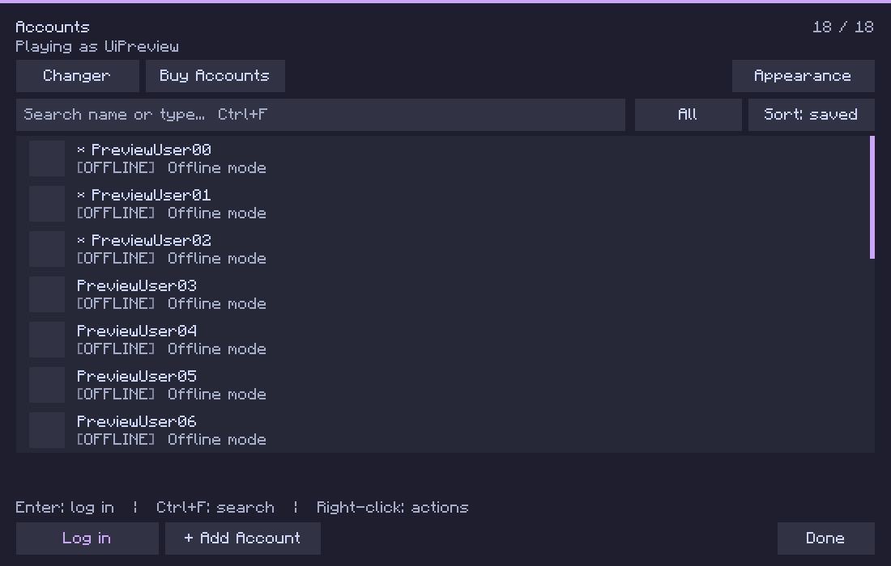
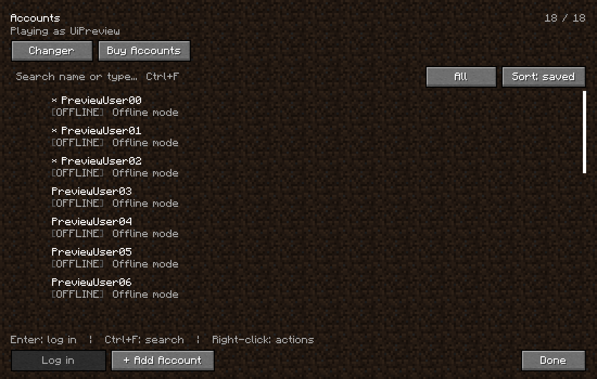

# Universal Account Manager v2

## Download (Forge 1.8.9)

Get **one** edition from [release v2.15](https://github.com/sc6the/UniversalAccountManager/releases/tag/v2.15)
and place its JAR in your Minecraft `mods` folder. Remove older UAM JARs before launching;
do not install Modern and Legacy together. BlankUtils is optional, not required.

| Edition | Download | Appearance |
| --- | --- | --- |
| Legacy (default) | [Legacy JAR](https://github.com/sc6the/UniversalAccountManager/releases/download/v2.15/UniversalAccountManager-2.15-legacy.jar) | Selected resource pack's vanilla widgets, transparent panels, Vanilla colors |
| Modern | [Modern JAR](https://github.com/sc6the/UniversalAccountManager/releases/download/v2.15/UniversalAccountManager-2.15-modern.jar) | Catppuccin Mocha, Vanilla, OLED Black & White, and custom colors |

Both editions have the same account-management features. The release also includes SHA-256 checksums.
Local account files, store API keys and personal configuration are not bundled.

## Compact UI (2.15)

The main menu now has an **Accounts** button. Modern and Legacy share the same compact layout
and features; Modern uses flat surfaces, while Legacy uses Minecraft's native buttons from
the selected resource pack's `assets/minecraft/textures/gui/widgets.png`, including normal,
hovered and disabled states, and the vanilla screen background. Resource-pack reloads apply
automatically. Custom button colors/backgrounds apply to Modern; Legacy preserves the pack's artwork.
Legacy's search, account rows, list and preview panels have transparent backgrounds.
Modern's **Appearance** menu includes Catppuccin Mocha, Vanilla and OLED Black & White presets,
plus custom accent, background, surface, text and muted-text colors (`#RRGGBB`). Mocha uses the
[official Catppuccin palette](https://github.com/catppuccin/catppuccin#-palette); Vanilla uses white
text with green success/red error colors; OLED uses a pure-black background and monochrome colors.
The editor saves to `config/universalaccountmanager-theme-modern.properties`, which can be copied
to share a custom theme. Legacy always forces Vanilla colors and has no Appearance menu;
saved custom colors cannot override it. The standard jar and installer default to Legacy.

The account list includes name/type search, pinned-only filtering, saved/A-Z ordering, mouse-wheel
scrolling, active-session highlighting, copy-name and confirmed removal with one-step undo.
Only visible rows render; no additional UI dependencies, blur passes or animations are loaded.

- Ctrl+F: focus search. Escape clears search first, then returns.
- Up/Down, Page Up/Down, Home/End: select and reveal a row. Enter: log in.
- Ctrl+C: copy the selected name. Right-click a row: log in, pin/unpin, copy name, delete,
  or save the active launcher account. The footer keeps Log in, Add Account and Done.
- Ctrl+Up/Down: reorder within the pinned/unpinned group in unfiltered saved order.
- Delete: confirm removal. Ctrl+Z or the temporary Undo button restores the last removed account.
  Undo remains available until this account-screen instance is discarded.

Build both editions and run the preferences test with Java 8:

```powershell
.\gradlew.bat modernJar legacyJar themeTest
```

Outputs: `build/libs/UniversalAccountManager-2.15-modern.jar` and `-legacy.jar`.
Install only one edition at a time. Change editions by replacing the jar; presets are Modern-only.
`scripts/install.ps1` installs Legacy UAM and the already-built sibling BlankUtils jar,
backs up replaced jars under `.minecraft/mod-backups`, and stores the other edition outside the
active mods folder. Use `-Edition modern` to explicitly choose the Modern edition.

For an isolated in-game check with synthetic offline accounts (no real credentials):

```powershell
.\gradlew.bat reobfSmokeJar
.\scripts\smoke.ps1 -Edition modern -WithUtils
```

The opt-in smoke mod is never included in release jars. Logs and screenshots are in `build/smoke-*`.

## Preview

Actual in-game screenshots from version 2.15, using synthetic offline accounts.

### Modern — Catppuccin Mocha



### Legacy — vanilla resource pack



Legacy follows the selected resource pack's `widgets.png`; this preview uses Minecraft's default
pack. It always uses Vanilla colors and does not offer an Appearance menu.


## Features

- **Microsoft device-code login** (`microsoft.com/link`) - the recommended way to add an account
- Microsoft browser login (local callback on port 25575)
- **Refresh-token import** - one token, a clipboard list, or a `.txt` file
- **Offline (cracked) accounts** - username only, for offline-mode servers
- Cookie login from a Netscape `cookies.txt` export
- Minecraft access-token login from the original mod
- Hypixel Ban Checker + Duration
- A main-screen **Buy Accounts** entry with one screen shared by **Localts**, **Nicealts** and
  **Fernan Club**
- Namechanger and Skinchanger

## Login methods, and which one to use

| Method | What it stores | Expires? |
| --- | --- | --- |
| Device code | MSA refresh token | No - refreshed on login |
| Refresh-token import | MSA (or Azure) refresh token | No - refreshed on login |
| Cookie file | MSA refresh token when Microsoft grants one, else a raw token | No / ~24h |
| Browser | Azure refresh token | No - refreshed on login |
| Minecraft token | The pasted token | ~24h, no recovery |
| Offline | Nothing | Never |

Anything holding a refresh token is refreshed automatically when you log into it, so those
accounts stay usable indefinitely. Only pasted access tokens really expire.

## One store screen, three shops

Buying used to mean two screens with two different feature sets: Localts had categories, quantity,
order history, per-order re-imports and a dead-item cache; Nicealts had six buttons. A shop is now a
`StoreProvider` (`store/`) and `GuiStore` drives all of them, so connecting, browsing, quantity, the
confirmation dialog, importing, retrying a failed import and re-importing past purchases behave
identically wherever the account came from. The API key is DPAPI-encrypted per shop by
`StoreCredentialStore`, and `StoreImportTracker` keeps one cache of what has already been imported
and what is dead.

Every delivery is also written to `DeliveryLog` (`config/universalaccountmanager_store_deliveries.dat`,
DPAPI-encrypted, since the entries are live credentials). Nicealts only returns its five most recent
purchases, so the local log preserves older deliveries and gives it the same **Retry Import** and
**Import Delivery ID** flow as the other shops.

| | Localts | Nicealts | Fernan Club |
| --- | --- | --- | --- |
| Categories, quantity, confirmation | yes | yes | yes |
| Import previous purchases | server history | latest 5 from server + local delivery log | server history |
| Re-import one order by id | yes | from the delivery log | yes |
| Delivery | refresh token / cookie | `mctoken` + `refreshtoken` | base64 cookie file + access token |
| Custom purchase (`/api/custompurchase`) | - | **yes** | - |
| Subscription generator (`/api/generate`) | - | **yes** | - |
| Redeem a Peso key | - | - | **yes** |
| Request a refund | - | - | **yes** |

### Imported once, ignored for good

An item that has been imported is never offered again. The record used to lapse as soon as the
account it produced left the list or stopped validating, so every deleted or expired alt came back
on the next scan to be skipped by hand - and a lapsed record also makes its order look importable,
which kept the history scan paying to read orders it had already finished with.

The way back, if an account was deleted by mistake, is the single-order lookup: type its order id
and hold Shift, which re-offers that order's already-imported and dead items. Only that one order.

### Scanning past purchases

`/v1/orders` lists an order but not what was in it, so every order needs its own read, and shops
rate limit that hard - Localts starts throttling at around the twentieth read, after which each
request pays the client's internal 429 backoff (1.5s, then 3s, then 6s). Parallelism cannot beat a
server-side limiter, so the scan's job is to read as few orders as possible and to pace the ones it
does read.

- **Stops when it stops finding anything.** History is read newest first, and accounts are imported
  in order, so twelve consecutive freshly-read orders with nothing new means everything older was
  imported too. A normal scan stops there and says so; hold **Shift** for a full scan (which also
  retries items cached as dead). Typical cost: a dozen or two reads instead of the whole history.
- **Never re-reads a cached order.** Everything read goes into `DeliveryLog`, so a second scan, or
  resuming a cancelled one, does no network at all. Cached orders are free, so they are always
  processed in full and never count towards the stop.
- **Paces itself off real throttling.** The clients retry a 429 internally and usually succeed, so a
  scan watching only for thrown errors never learns it is being limited - it just feels slow. Every
  429 is now published through `RateLimitSignal`; the pacer widens its interval (200ms doubling to
  4s), honours `Retry-After`, holds every queued slot back rather than just the thread that hit it,
  and creeps back down after twelve clean reads.
- **Reads four at a time**, in windows of eight, so the barren check gets a say every window.
- **Survives a failed read** - counted and reported, not fatal.
- **Can be stopped** - the button becomes *Cancel Scan*, progress is flushed every 25 orders, and
  the next run carries on from there.

The shop-specific extras are the deliberate exceptions - they are buttons that appear when
`StoreCapabilities` says the shop has them, not separate screens with separate habits.

### Nicealts

The endpoint set follows Nicealts' public API documentation. That also fixed a real bug: a purchased
item arrives as `mctoken: <token> | refreshtoken: <token>`, and the old code fed that whole string
to the refresh-token parser. Product 4 is available through the purchase API, and prices come from
`/public/stock`, so confirmations follow shop price changes instead of a hard-coded list.

**Custom purchase** buys one alt that Nicealts has just checked against a server you name (host or
`host:port`, port defaults to 25565), on protocol `1.8`, `1.21` or `26.1`. The normal ban check
costs 5 credits and the chat ban check costs 6; typing a Minemen address forces chat mode, because
that is the only mode Minemen is sold with. One call is one account - the endpoint has no quantity
field - so the quantity control is absent on that screen only.

**Generate** is included with a Premium/Premium+ subscription and costs no credits, but it delivers
a bare Minecraft token, so those accounts last about a day rather than being refreshable.

If the Nicealts manager mod left a key at `%APPDATA%/nicealts_manager/nicealtsapi.txt` (or
`localtsapi.txt`), it is picked up the first time and then re-saved through DPAPI.

### Fernan Club

`https://api.fernan.club/api/v1`, `X-API-Key`, every reply wrapped as `{"success", "data"}`.
Deliveries carry a base64 Netscape cookie file *and* a live access token, so an import trades the
cookies for a refresh token first and only falls back to the access token if that fails - the
difference between a permanent account and a one-day one. Purchase history, cooldowns and per-order
purchase limits are all honoured, dead items can be sent back through **Request Refund**, and a Peso
key can be redeemed from the store screen.

One caveat: the published docs give the refund request's body and its `201` but not its path, so
`FernanClient.REFUND_PATH` is `POST /store/refunds` - the write side of the collection the two
documented reads use. If refunds answer 404, that constant is the thing to change.

## Two Microsoft clients

The mod talks to Microsoft as two different OAuth clients and they are **not** interchangeable -
a refresh token minted by one is rejected by the other:

- **Legacy MSA** (`00000000402b5328`, the launcher's client) - what the alt shops sell, what the
  device-code flow needs (the Azure app is refused with `AADSTS70002: the client must be marked as
  mobile`), and what the cookie login now asks for. Its Xbox `user/authenticate` step needs the
  `t=` RpsTicket prefix.
- **Azure app** (`42a60a84-...`) - the in-mod browser login. Uses the `d=` prefix.

`AccountLogin` tries the client an account is tagged with first and the other one as a fallback,
then records whichever worked (`msa` or `ms`), so a mixed list of imported tokens just works.

## Notes on the 2.13 fixes

- **Cookie login was broken by Microsoft, not by the mod.** `sisu.xboxlive.com/connect/XboxLive`
  now redirects to `login.microsoftonline.com/consumers`, not `login.live.com`, so the old
  fixed three-hop chain ran out of hops and never sent the cookies to the host that needed them.
  The login now asks `login.live.com/oauth20_authorize.srf` for an authorization code directly
  (`prompt=none`, falling back to a normal authorize), which also means a cookie login yields a
  refresh token instead of a one-day session. The old chain is still there as a fallback, but with
  a real per-host cookie jar (`CookieJar`) and no hop limit.
- **Expiring accounts.** Accounts were refreshed through the Azure app only, so every alt-shop and
  cookie account died as soon as its Minecraft token aged out. Logging in from the list now goes
  through `AccountLogin` (`LoginController` replaces the bundled `doLogin`), which tries the stored
  token, then both clients.
- **Accounts vanishing.** The startup refresher used to refresh every Microsoft account in parallel
  on every launch; Microsoft rotates a refresh token on use and invalidates the old one, so bursts
  drew 429s and raced the player's own login. It now checks the stored token first and refreshes
  only dead accounts, one at a time. `AccountValidator` treats anything with a refresh token as
  usable, and `ExpiredAccountCleaner` no longer deletes refreshable or offline accounts.

## Build

Use Java 8 and run:

```powershell
.\gradlew.bat clean repairedJar
```

The standalone mod is written to
`build/libs/UniversalAccountManager-2.15.jar` (Legacy default).

The build is an overlay: classes compiled here shadow same-named classes from
`libs/UniversalAccountManager-1.7-original.jar` when the two are merged, and mixins cover what
cannot be replaced wholesale.

No shop password is ever entered into the mod. The store screen's Open button sends you to the
shop's own site for an API key, and the key itself is only ever stored DPAPI-encrypted for the
current Windows user. Every purchase shows the exact product, quantity and credit total in a
confirmation dialog before any purchase endpoint is called.
